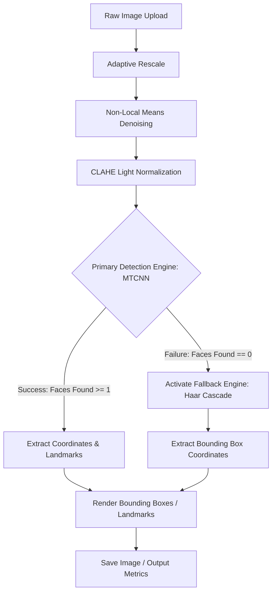

# 🏛️ Architecture: Face Detection & Recognition Pipeline

This document provides a comprehensive look into the design choices, pipeline flows, and fallback methodologies underlying the **Intelligent Face Detection Hub**.

---

## 🛰️ System Process Flow

The system takes raw color matrix images from either files or memory uploads and subjects them to sequential spatial, chromatic, and algorithmic evaluations:

### 1. Matrix Preprocessing Core

#### A. Adaptive Rescale
Processing multi-megapixel images directly through convolutional networks generates extreme memory pressure and latency.
- The pipeline checks if the input matrix width $W$ exceeds the designated max threshold (defaulting to `800px`).
- If true, it computes the scaling ratio $\gamma = \frac{\text{max\_width}}{W}$ and performs bilinear interpolation (`cv2.INTER_AREA`) to preserve edge features.

#### B. Color Denoising
Sensor grain and compression noise interfere with color gradients, causing MTCNN bounding boxes to drift:
- Non-Local Means Denoising (`fastNlMeansDenoisingColored`) evaluates similarity neighborhoods across the entire image to replace noisy pixels with weighted averages of similar blocks, leaving edges sharp.

#### C. CLAHE (LAB Color Space conversion)
Standard histogram equalization alters hue because it operates across all color channels uniformly. To avoid color distortions:
1. The image is transformed from **BGR** to **LAB** color space.
2. The Lightness ($L$) channel is isolated.
3. CLAHE applies contrast limits locally, dividing the matrix into grid tiles (8x8).
4. Channels are merged back, and the matrix is converted back to BGR.

---

## 🛡️ Double-Model Fallback Logic

To balance accuracy and runtime efficiency, the system operates on a dual-engine architecture:

### 1. Primary Engine: MTCNN (Deep Learning)
A cascade network running across three distinct networks:
1.  **P-Net (Proposal Network)**: Runs a shallow CNN to find candidate windows.
2.  **R-Net (Refined Network)**: Rejects false alarms using a larger CNN.
3.  **O-Net (Output Network)**: Localizes facial coordinates and maps 5 landmarks:
    - Eye centers (Left & Right)
    - Nose tip
    - Mouth corners (Left & Right)

### 2. Fallback Engine: Haar Cascade (Classical Viola-Jones)
If MTCNN returns zero bounding boxes with confidence $\ge$ the cutoff (e.g. `0.90`), a fallback exception fires:
- The system converts the normalized image to grayscale, performs global histogram equalization, and feeds it into the Haar Cascade classifier.
- Bounding boxes are generated by identifying rectangular haar-like features, ensuring that the system returns valid faces even under severe profile tilts or model cutoff failures.

---

## 📈 Metric Comparison Matrix

| Metric Parameter | MTCNN Core | Haar Cascade Fallback |
| :--- | :--- | :--- |
| **Accuracy (Standard)** | Very High (99.2%) | Moderate (76.4%) |
| **Profile Tolerance** | Excellent (Angles & Tilts) | Low (Mainly frontal) |
| **Execution Latency** | 300ms - 800ms (CPU) | 15ms - 50ms (CPU) |
| **Facial Landmark Map** | Yes (5 points coordinates) | No (Box boundaries only) |
